# Capstone-Generator

## Table of Contents

- [Generator Design](https://github.com/lhange42/Capstone-Generator/blob/main/README.md#generator-design)
  * [Assembly](https://github.com/lhange42/Capstone-Generator/blob/main/README.md#description-of-assembly)
  * [Research](https://github.com/lhange42/Capstone-Generator/blob/main/README.md#research)
- [CAD](https://github.com/lhange42/Capstone-Generator/blob/main/README.md#cad)
  * [Parts](https://github.com/lhange42/Capstone-Generator#parts)
    + [Box Parts](https://github.com/lhange42/Capstone-Generator#box)
    + [Generator Parts](https://github.com/lhange42/Capstone-Generator#generator)
  * [Assembly](https://github.com/lhange42/Capstone-Generator#assembly)
    + [Assembly](https://github.com/lhange42/Capstone-Generator/blob/main/README.md#assembly)
  * [Other Components](https://github.com/lhange42/Capstone-Generator#assembly)	
    + [Nuts & Bolts](https://github.com/lhange42/Capstone-Generator/blob/main/README.md#nuts--bolts)
    + [Bearings](https://github.com/lhange42/Capstone-Generator/blob/main/README.md#bearings)
    + [Steel Rod](https://github.com/lhange42/Capstone-Generator/blob/main/README.md#steel-rod)
    + [Steel Rod](https://github.com/lhange42/Capstone-Generator/blob/main/README.md#steel-rod)
- [Code](https://github.com/lhange42/Capstone-Generator/blob/main/README.md#code)
  * [FuncAngleOMeter](https://github.com/omckenn37/EG4_Trebuchet/blob/main/README.md#funcangleometer)
  * [Index](https://github.com/omckenn37/EG4_Trebuchet/blob/main/README.md#index)
  * [Get Angle Test](https://github.com/omckenn37/EG4_Trebuchet/blob/main/README.md#get-angle-test)
- [Physical Assembly](https://github.com/lhange42/Capstone-Generator/blob/main/README.md#physical-assembly)
  * [Capsule](https://github.com/omckenn37/EG4_Trebuchet/blob/main/README.md#capsule)
  * [Trebuchet](https://github.com/omckenn37/EG4_Trebuchet/blob/main/README.md#trebuchet)
- [Results and Overall Reflections](https://github.com/lhange42/Capstone-Generator/blob/main/README.md#results-and-overall-reflections)

## Generator Design
<p float="left">
	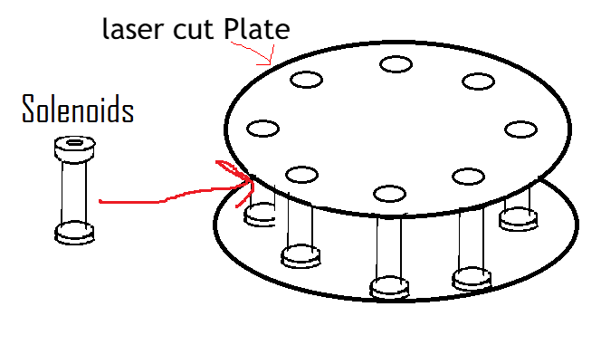
	
	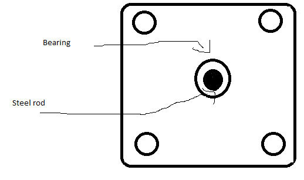
	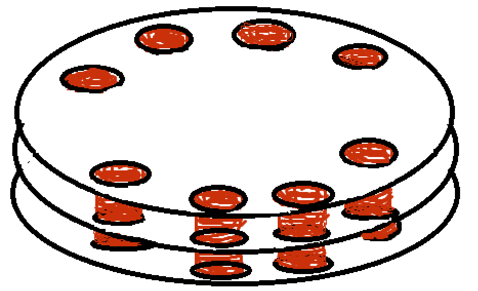
</p>

### Description of Assembly

The first picture on the left is showing the center of the generator which will be composed of two laser cut plates and 8 solenoids. These solenoids will be held in place by the circular slots in the laser cut piece that will equal the radius of the smaller section of the solenoid. However, this plan is one of the first ideas and our new idea is to make a friction fit layer of three plates that will hold 8 coils; we are doing this to create less separation between the magnets and the coils. The two laser-cut plates will be screwed together so the solenoids are tightly held in between them. The second picture is a sheet of laser cut material and the thickness of the laser cut material is the exact same as the magnets so this will make it easy to stack plates to make our magnets securely harnessed. In terms of generator diction, our center ring of coils will bet the stator of the generator since it’s stationary and just harnessing power while the ring of magnets is going to be the rotor since it will be attached to the rotating axis and spinning with it.

### Research
#### Magnetic Induction
Magnetic induction is how we are going to produce voltage with our generator. Magnetic Induction is when alternating magnetic poles induce an electrical current. So as our generator harnesses rotational motion and spins the plates that contain the magnets around the coils it will induce a current in the coils. This voltage is formed through the magnetic fields going through the magnetic flux of the coil which produces energy because flux creates energy from anything passing through its field. This is why our generator will originally produce an alternating current because as the magnets rotate and the polls flip the direction of the voltage will also flip. This is all found by Micahel Faraday who created a formula to calculate an emf or electromotive force; specifcally used to calculate the instantaneous voltage because it can be different depending on the point you read it at. 
#### Circuit Divider
A circuit divider basically is a system of two resistors in which if you position the wires correctly,  one between the resistors and one after the second one,  that the voltage going through those wires will be less than the voltage in the whole circuit, and as you change the ratio of the resistors the amount that the voltage is divided by is increased. To divide your voltage by the greatest amount you want to make the first resistor a lot larger than the second resistor. We are planning on testing our generator and finding out the maximum voltage then setting up a circuit divider that will guarantee a voltage under 5V so the pi can read it, since the pi only reads 0V to 5V, and to compensate the voltage divider we will just multiply the value read by the value that voltage divider divides it by to return it to its true voltage. A circuit divider is going to be mandatory for the methodology of our project we are going to need to be able to read the voltage of the generator in some form that will communicate with the pi because it’s the focus of the coding part of our project. 


## CAD

### Parts
#### Box
#### Generator
##### Coil Mold
<p float="left">
	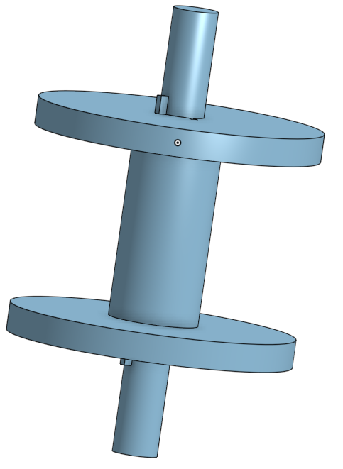
	
	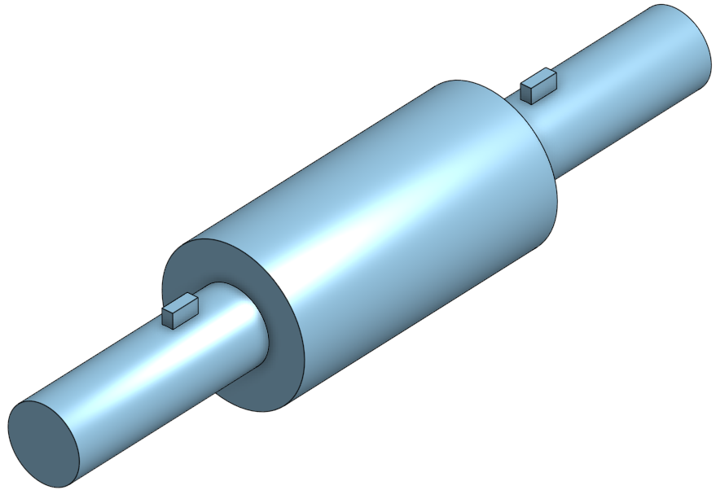
</p>

###### Description

This is going to be used to form our coils. They are constructible solenoids with detachable ends. We plan on them being attachable to drills so we can spin and coil the solenoid. Then once the coil is made and fastened together so it doesn’t become uncoiled we can detach the ends by rotating them until the slot lines up and then its just constructed around the center that we can detach.

##### Coil Plate
<p float="left">
	

</p>
###### Description


##### Magnet Plate
<p float="left">
	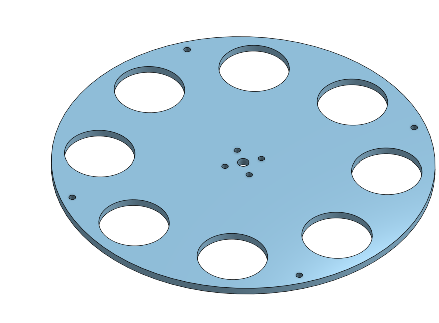
</p>

###### Description

This is our magnet plate design we have the center holes for an axle and the axle hub this will help us ensure that the axle is fixed in its position. The axle hole is the one at the exact center that's larger and the axle hub holes are the 4 smaller holes meant for screws that closely surround the center axle hole. It has 8 holes for the magnets and since we are stacking magnets we will also be stacking our magnet plates this ensures that the width of the laser cut acrylic magnet plates is the same width.

### Assembly
<p float="left">
	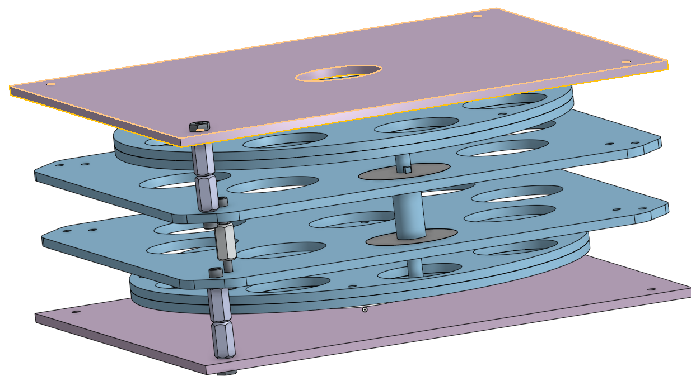
	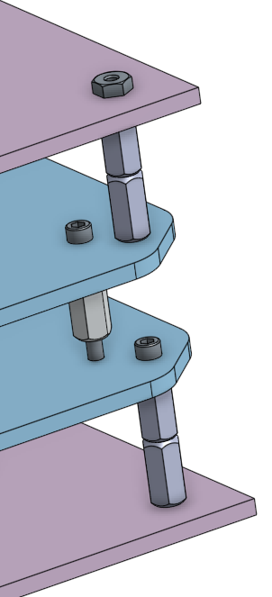
	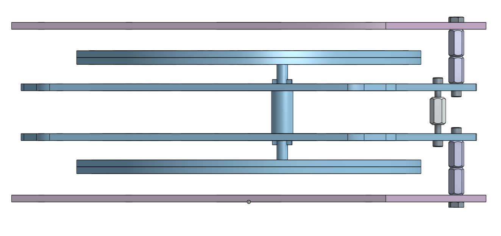

</p>

#### Description

This is a current setup of our assembly of course missing some components because they can't be added to onshape. You can see the series of standoffs, screws, and nuts those will be repeated in each corner. Some of the missing parts are the magnets, wire, axle rod, axle hub, and a bearing. You can also see that the coil goes through the holes of the Magnet Plate but that in our real version we are cutting off the excess rods on the coils which were only used to wrap it better. 

### Other Components

#### Nuts & Bolts & Standoffs
For these we will be using the standard hex nuts, bolts, and standoffs that are provided for in the lab. Standoff are going to be pretty key in this project because many of are plates are significant distances away and they will have to be connected by a long series of standoffs. 


#### Bearings

We will need bearings in order to have the axle also connected to the box sides but still spin. Since the magnet plates are only mounted to the axle these bearing are needed to make the system complete. The center coils are connected to the box sides so then it ensures that everything is connected.

#### Axle & Axle Hubs

For this project we are going to have to have an axle of rotation and the best way of doing this is by ordering an actual axle. So for our design we need two axle hubs and one axle. The 2 axle hubs are going to be connected to each magnet plate so that they ensure that they spin with the axle. So how the axle hub works is that it is a ring that will surroind the axle and be screwed into whatever you are trying to get to spin with the axle and then the axle hub has a horizontal screw slot that screws against the axle holding it in place, it's called a set screw for that purpose.

<p float="left">
  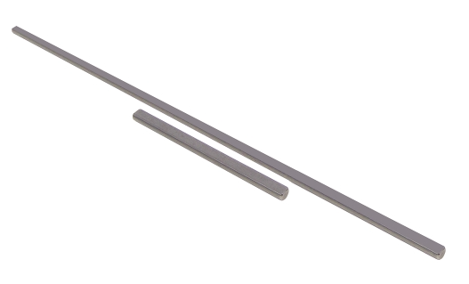
  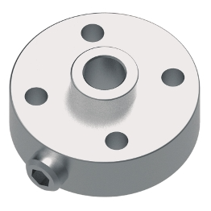
</p>

---


## Code


### Voltage reader


<details>
<summary>Code</summary>
<!--All you need is a blank line-->

**Python** *Code*
```python
import adafruit_ssd1306
import digitalio
import board
import busio
import time
import adafruit_ina260

i2c = board.I2C()
ina260 = adafruit_ina260.INA260(i2c)

i2c = busio.I2C(board.SCL, board.SDA)
from PIL import Image, ImageDraw, ImageFont
reset_pin = digitalio.DigitalInOut(board.D24) # any pin!
oled = adafruit_ssd1306.SSD1306_I2C(128, 64, i2c, addr = 0x3d, reset=reset_pin)


oled.fill(0)
oled.show()


image = Image.new("1", (oled.width, oled.height))

draw = ImageDraw.Draw(image)
font = ImageFont.load_default()
while True:

    print("Current: %.2f Voltage: %.2f Power:%.2f"
        %(ina260.current, ina260.voltage, ina260.power))
    text = "Voltage:" + str(ina260.current / 4) 
    (font_width, font_height) = font.getsize(text)
    draw.text(
    (0 + 20 , 0 + 20),
    text,
    font=font,
    fill=255,
)
    print(ina260.current)

    oled.image(image)
    oled.show()
    time.sleep(1)
    draw.rectangle((0, 0, oled.width, oled.height), outline=0, fill=0)
    oled.image(image)
    oled.show

```
</details>


	
## Physical Assembly
### Generator
	
#### Inner Generator
<p float="left">
  
  
  
</p>

	
#### part 1

	
#### Components of the generator
	

### box


<p float="left">


</p>
	
## Results and Overall Reflections
	

