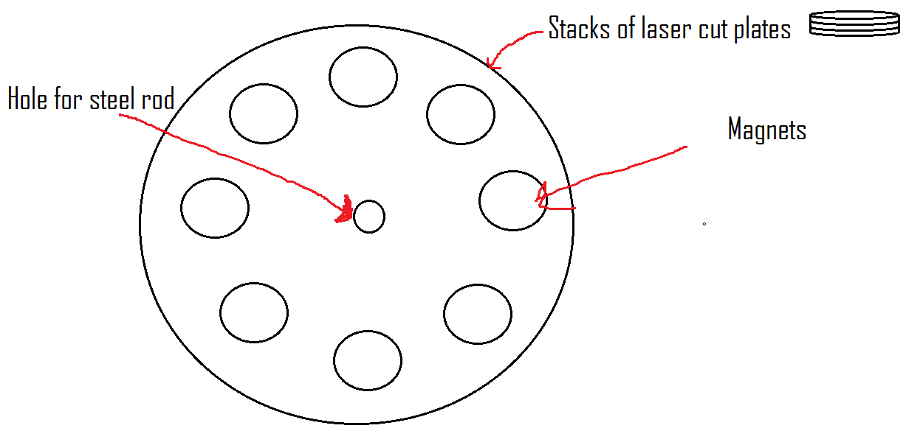
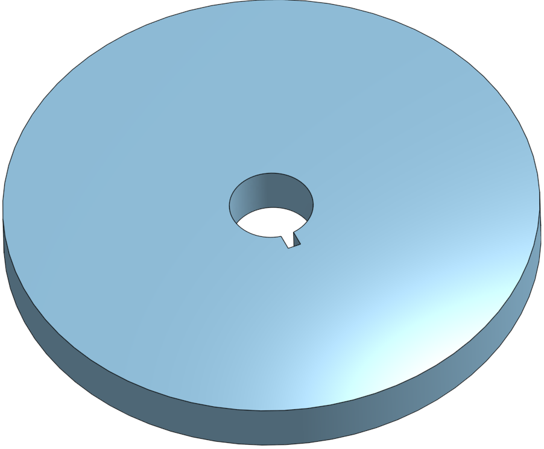

# Capstone-Generator

## Table of Contents

- [Generator Design](https://github.com/lhange42/Capstone-Generator/blob/main/README.md#generator-design)
  * [Assembly](https://github.com/lhange42/Capstone-Generator/blob/main/README.md#description-of-assembly)
  * [Research](https://github.com/lhange42/Capstone-Generator/blob/main/README.md#research)
- [CAD](https://github.com/lhange42/Capstone-Generator/blob/main/README.md#cad)
  * [Parts](https://github.com/lhange42/Capstone-Generator#parts)
    + [Box Parts](https://github.com/lhange42/Capstone-Generator#box)
    + [Generator Parts](https://github.com/lhange42/Capstone-Generator#generator)
  * [Assembly](https://github.com/lhange42/Capstone-Generator#assembly)
    + [Assembly](https://github.com/lhange42/Capstone-Generator/blob/main/README.md#assembly)
  * [Other Components](https://github.com/lhange42/Capstone-Generator#assembly)	
    + [Nuts & Bolts](https://github.com/lhange42/Capstone-Generator/blob/main/README.md#nuts--bolts)
    + [Bearings](https://github.com/lhange42/Capstone-Generator/blob/main/README.md#bearings)
    + [Axle & Axle Hub](https://github.com/lhange42/Capstone-Generator/blob/main/README.md#axle--axle-hubs)

- [Code](https://github.com/lhange42/Capstone-Generator/blob/main/README.md#code)
  * [Voltage Reader](https://github.com/lhange42/Capstone-Generator/blob/main/README.md#voltage-reader)
- [Physical Assembly](https://github.com/lhange42/Capstone-Generator/blob/main/README.md#physical-assembly)
  * [Generator](https://github.com/lhange42/Capstone-Generator/blob/main/README.md#generator-1)
  * [Box](https://github.com/lhange42/Capstone-Generator/blob/main/README.md#box-1)
- [Results and Overall Reflections](https://github.com/lhange42/Capstone-Generator/blob/main/README.md#results-and-overall-reflections)

## Generator Design
<p float="left">
	
	
	
	
</p>

### Description of Assembly

The first picture on the left is showing the center of the generator which will be composed of two laser cut plates and 8 solenoids. These solenoids will be held in place by the circular slots in the laser cut piece that will equal the radius of the smaller section of the solenoid. However, this plan is one of the first ideas and our new idea is to make a friction fit layer of three plates that will hold 8 coils; we are doing this to create less separation between the magnets and the coils. The two laser-cut plates will be screwed together so the solenoids are tightly held in between them. The second picture is a sheet of laser cut material and the thickness of the laser cut material is the exact same as the magnets so this will make it easy to stack plates to make our magnets securely harnessed. In terms of generator diction, our center ring of coils will be the stator of the generator since it’s stationary and just harnessing power while the ring of magnets is going to be the rotor since it will be attached to the rotating axis and spinning with it. These generator will be 2 phase which means that their are two circuits that our generator will be divided into. The reason this is, is because our ring of magnets will be alteranting poles so each coil will be experiencing the opposite poles of the one next to it this is why it's an alternating current. So Coil 1,3,5,7 will be connected and coil 2,4,6,8 will be connected


### Research
#### Magnetic Induction
Magnetic induction is how we are going to produce voltage with our generator. Magnetic Induction is when alternating magnetic poles induce an electrical current. So as our generator harnesses rotational motion and spins the plates that contain the magnets around the coils it will induce a current in the coils. This voltage is formed through the magnetic fields going through the magnetic flux of the coil which produces energy because flux creates energy from anything passing through its field (See Left Picture below for visualization of flux). This is because the magnets move the electrons through the coils. This is why our generator will originally produce an alternating current because as the magnets rotate and the polls flip the direction of the voltage will also flip(right picture shows how alternating poles create alternating current). This is all found by Micahel Faraday who created a formula to calculate an emf or electromotive force; specifcally used to calculate the instantaneous voltage because it can be different depending on the point you read it at. 
<p float="left">
	
	
</p>

#### Circuit Divider
A circuit divider basically is a system of two resistors in which if you position the wires correctly,  one between the resistors and one after the second one,  that the voltage going through those wires will be less than the voltage in the whole circuit, and as you change the ratio of the resistors the amount that the voltage is divided by is increased. To divide your voltage by the greatest amount you want to make the first resistor a lot larger than the second resistor. We are planning on testing our generator and finding out the maximum voltage then setting up a circuit divider that will guarantee a voltage under 5V so the pi can read it, since the pi only reads 0V to 5V, and to compensate the voltage divider we will just multiply the value read by the value that voltage divider divides it by to return it to its true voltage. A circuit divider is going to be mandatory for the methodology of our project we are going to need to be able to read the voltage of the generator in some form that will communicate with the pi because it’s the focus of the coding part of our project. Thankfully we found a adafruit device that allows us to read higher volts but this was still a valuable idea that we learned and I think is important.

#### Rectifier

Rectifiers are a set up of diodes that only let the positive voltage pass throuhg turning your AC current into DC current. A diode is simply an electric component that has bery high resistance in one direction and particularly low resistance in the other. We are specifically using a bridge rectifier which shown in the diagram below is a series of 4 diodes in a dimaond shape the direction of all of them is facing the positive output. In the diagram you can see how the AC input would be alternating and be connected to the rectifier in between the top diodes and inbetweent he bottom diodes. The negative output is taken from the left diode which are both pointing away from that outpoint and the positive is taken from the right that has the diodes pointing to it.
<p float="left">
	
</p>


---
## CAD

### Parts
#### Box

##### Box Without Pi Mount

<p float="left">
	
</p>

###### Description

This is the wall of the box this is only on one side of the generator. This side will be the one without the pi mount. the hole directly in the center is meant for bearings. The 4 holes in the corners is meant for screws to connect standoffs that will connect this wall to one of the coil plates.

##### Box With Pi Mount

<p float="left">
	
</p>

###### Description

This one is slightly different because you can see the mount where the pi will be attatched. This also has four holes in the corners of the rectangular pi plate this is going to be used for standoffs to connect the breadboard plate so it will be a layered and be able to be right next to the coils. This has the seem other layout of the Box wall with no Pi mount with the central hole for bearings and the other holes for connecting to the coil plate with standoffs. 

##### Bread Board Platform

<p float="left">
	
</p>

###### Description

This is quite a simple piece but it has invaluable job of holding the breadboard which will be where all the coils voltage is being read and sent to the pi. It will be elevated from the box wall with the pi by standoffs and will practically sit on level with the center of the coils. This position is perfect in acheiving simple wiring which is always a plus. The Bread Board itself has a sticky bottom which allows it to stick to the bottom and we won't need to screw it down or anything.

#### Generator
##### Coil Mold
<p float="left">
	
	
	
</p>


###### Description

This is going to be used to form our coils. They are constructible solenoids with detachable ends. We plan on them being attachable to drills so we can spin and coil the solenoid. Then once the coil is made and fastened together so it doesn’t become uncoiled we can detach the ends by rotating them until the slot lines up and then its just constructed around the center that we can detach.

##### Coil Plate
<p float="left">
	

</p>

###### Description
The Coil Plate is the stator in our generator and will be the center between two magnet plates. It is friction fitting the coils into the plate. These will be where the electricity is induced in our generator.

##### Magnet Plate
<p float="left">
	
</p>

###### Description

This is our magnet plate design we have the center holes for an axle and the axle hub this will help us ensure that the axle is fixed in its position. The axle hole is the one at the exact center that's larger and the axle hub holes are the 4 smaller holes meant for screws that closely surround the center axle hole. It has 8 holes for the magnets and since we are stacking magnets we will also be stacking our magnet plates this ensures that the width of the laser cut acrylic magnet plates is the same width.

### Assembly
<p float="left">
	
	
	
	

</p>

#### Description

This is a current setup of our assembly of course missing some components because they can't be added to onshape. You can see the series of standoffs, screws, and nuts those will be repeated in each corner. Some of the missing parts are the magnets, wire, axle rod, axle hub, raspberry pi, breadboard and bearings. You can also see that the coil goes through the holes of the Magnet Plate but that in our real version we are cutting off the excess rods on the coils which were only used to wrap it better. 

### Other Components

#### Nuts & Bolts & Standoffs
For these we will be using the standard hex nuts, bolts, and standoffs that are provided for in the lab. Standoff are going to be pretty key in this project because many of are plates are significant distances away and they will have to be connected by a long series of standoffs. 


#### Bearings

We will need bearings in order to have the axle also connected to the box sides but still spin. Since the magnet plates are only mounted to the axle these bearing are needed to make the system complete. The center coils are connected to the box sides so then it ensures that everything is connected.

#### Axle & Axle Hubs

For this project we are going to have to have an axle of rotation and the best way of doing this is by ordering an actual axle. So for our design we need two axle hubs and one axle. The 2 axle hubs are going to be connected to each magnet plate so that they ensure that they spin with the axle. So how the axle hub works is that it is a ring that will surroind the axle and be screwed into whatever you are trying to get to spin with the axle and then the axle hub has a horizontal screw slot that screws against the axle holding it in place, it's called a set screw for that purpose.

<p float="left">
  
  
</p>


---
## Code


### Voltage reader


<details>
<summary>Code</summary>
<!--All you need is a blank line-->

**Python** *Code*
```python
import adafruit_ssd1306 #Importing all neccesary things for the code
import digitalio
import board
import busio
import time
import adafruit_ina260

i2c = board.I2C()
ina260 = adafruit_ina260.INA260(i2c)

i2c = busio.I2C(board.SCL, board.SDA)
from PIL import Image, ImageDraw, ImageFont
reset_pin = digitalio.DigitalInOut(board.D24) # any pin! #reset pin for the OLED Display
oled = adafruit_ssd1306.SSD1306_I2C(128, 64, i2c, addr = 0x3d, reset=reset_pin)# sets variable OLED equal to oled display and helps with call functions


oled.fill(0)
oled.show()


image = Image.new("1", (oled.width, oled.height))

draw = ImageDraw.Draw(image)
font = ImageFont.load_default()
while True:

    print("Current: %.2f Voltage: %.2f Power:%.2f"
        %(ina260.current, ina260.voltage, ina260.power))
    text = "Voltage:" + str(ina260.current / 4) 
    (font_width, font_height) = font.getsize(text)
    draw.text(
    (0 + 20 , 0 + 20),
    text,
    font=font,
    fill=255,
    )#That displays the voltage of the generator and orients t=it
    print(ina260.current)

    oled.image(image)
    oled.show()
    time.sleep(1)
    draw.rectangle((0, 0, oled.width, oled.height), outline=0, fill=0) #Wipes the display so the New Voltage can be printed
    oled.image(image)
    oled.show

```
</details>


#### Description

This is the code for our project. It involves an ina 260 which can read current, voltage, and power. This allows us to read the voltage of our generator. Our other electrical component is a OLED display so we can display the voltage. One problem we ran into is the Ina260 was only reading current but we did a few tests with different voltage batteries and found that if we divided the current by 4 we would get the voltage and that 4 was just specifically for the resistor we used.

---
## Physical Assembly
### Generator
	
#### Inner Generator
<p float="left">
  
  
  
  
</p>

##### Description
These are all the plates of our inner generator. The 1 on the left and the one in the middle are the coil plates whihc will be mounted and holding in the solenoids in the center of our generator. These got printed perfectly and we prototyped the size to make sure the solenoids would fit. The one on the right is one of our magnet plates that is a stack of two plates holding two disc magnets in each slot. These are all friction fit. You can see white coverings on some of the magnets this is something it came with and has helped us sepearte the magents when they get stuck together and since these are very powerful it will add a bit of cushion if magnets fly towards eachother. You can also see our coil plate with actual coils in it and this is before all the wire are sorted but shows the setup.

#### Components of the generator
	

##### Description
This is one of our coils it a 3D printed core with laser cut outer walls. We wrapped them with magnet wire to induce electricity. We have 8 of these set up in a circle to make our inner generator.

#### Full Generator

<p float="left">
  
  
  
</p>

### Box


#### Box With Pi
This is the Box face that will have the pi connected by standoffs and another three stack of standoffs that will be attatched to a laser cut platform for our bread board to sit on so that the T-cobbler can just connect up to the breadboard. This will also of course be connected to the coil plates to keep it in the central location and this will be a height of two standoffs. The center hole is meant for a bearing that will attatch the axle. This bearing is needed for the axis to have free rotation. The magnet plate will be attatched by an axle hub and will be between the coil plate and the box face.

#### Box Without Pi
This is a relatively simple box face that will do relatively the same hing as the previous one it just doesn't also hold the pi.

#### Box Assembled
<p float="left">
  
  
</p>

##### Description

The first pciture is of the Box faces with just the coils. This helps show the layers of our assembly. These are all the stationary components of the assembly.

	

